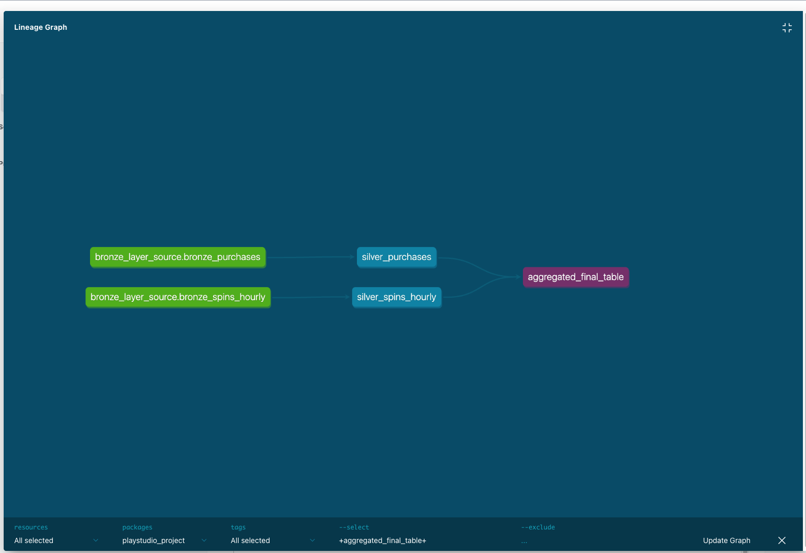
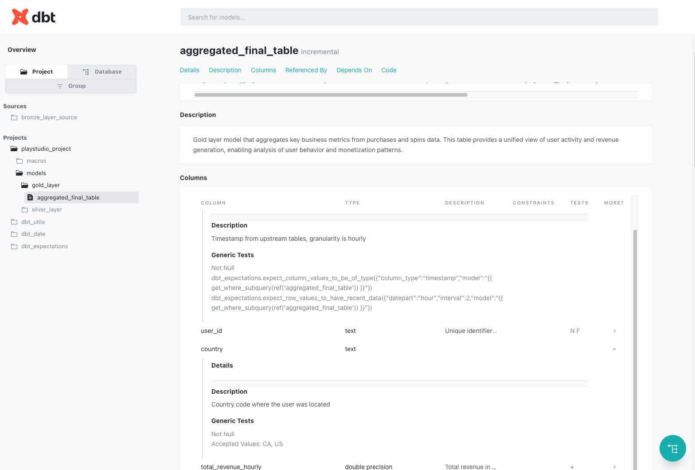
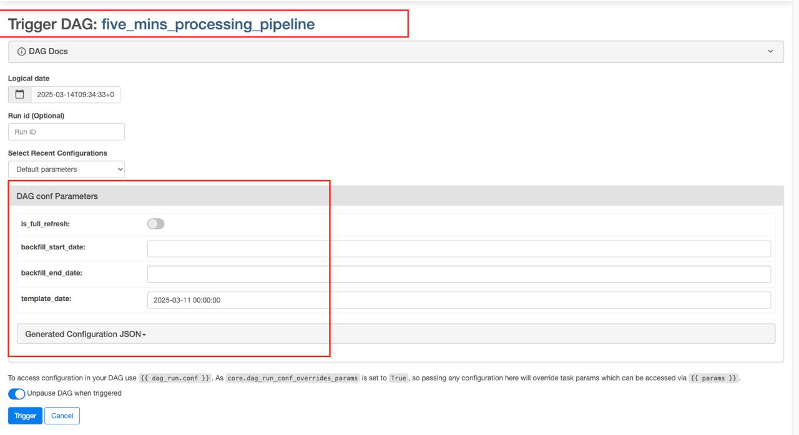

# PlayStudio Data Pipeline

A comprehensive data processing and analysis pipeline for PlayStudio user activity data. This project processes purchase and spins data at different intervals, validates data quality, and creates aggregated views for business insights.

## Project Overview

This project implements a data engineering solution that satisfies the following requirements:

1. **Task #1**: Process raw purchases and spins data from source files into a structured table with clear column naming
2. **Task #2**: Implement data validation tests to ensure data quality and integrity
3. **Task #3**: Create an Airflow pipeline architecture that handles:
   - Purchase data (updated every 5 minutes)
   - Spins hourly data (updated hourly)
   - Merging both data sources into a final aggregated table

The solution follows a medallion architecture with bronze (raw), silver (processed), and gold (aggregated) data layers.

## Tasks 1 & 2: Data Processing and Validation

Tasks 1 and 2 are implemented in the `scripts/task1_task2.py` script, which processes Excel data and performs data validation tests. This is a one-time process to generate a static output file.

### Running the Script

To execute tasks 1 and 2, simply run:

```bash
python scripts/task1_task2.py
```

The script will:
1. Read data from the Excel file specified in the `DATA_SOURCE_PATH` environment variable
2. Process and transform the data into a structured format
3. Generate an output file in the `output` folder
4. Run data validation tests with Great Expectations
5. Generate data quality documentation

### Data Validation Tests

The script implements multiple types of data quality tests using Great Expectations:

1. **Completeness Tests**
   - `ExpectColumnValuesToNotBeNull`: Ensures required fields like APP_HOUR, USERID, and COUNTRY aren't null

2. **Value Range Tests**
   - `ExpectColumnValuesToBeBetween`: Validates numeric fields (revenue, spins, purchases) are non-negative
   - Enforces reasonable upper bounds for metrics like TOTAL_SPINS_HOURLY and TOTAL_PURCHASES_AMOUNT_HOURLY

3. **Data Type Tests**
   - `ExpectColumnValuesToBeOfType`: Ensures each column has the correct data type (string, int64, float64)

4. **Uniqueness Tests**
   - `ExpectCompoundColumnsToBeUnique`: Verifies uniqueness of combinations (e.g., USERID + APP_HOUR)

5. **Schema Tests**
   - `ExpectTableColumnsToMatchOrderedList`: Confirms all expected columns exist in the correct order

6. **Referential Integrity Tests**
   - `ExpectColumnDistinctValuesToBeInSet`: Ensures COUNTRY values are only from the allowed set (US, CA, UNKNOWN)

7. **Business Logic Tests**
   - `ExpectColumnPairValuesToBeEqual`: Validates calculated revenue matches expected revenue based on average and count

8. **Row Count Tests**
   - `ExpectTableRowCountToEqual`: Ensures no data is lost during processing

### Handling Test Failures

For Tasks 1 and 2, test failures do not automatically fail the process since these are one-time data generation tasks. Instead:

1. All test results are recorded in Great Expectations' Data Docs UI
2. You can view detailed test results by examining the data docs in the `scripts/gx_project/uncommitted/data_docs/local_site/`
3. To open the Data Docs UI, set `OPEN_DATA_DOCS=true` in your .env file before running the script
4. When tests fail, inspect the data issues and modify the source data or processing logic as needed
5. Re-run the script until all validation tests pass

Below is an example of the Great Expectations test results dashboard:


## Task 3: Airflow Data Pipeline

### Architecture


The project consists of:

- **Data Sources**: Excel files with raw purchase and spins data
- **Data Processing**:
  - Python scripts to extract and transform data
  - DBT for modeling data
  - Great Expectations for data validation
- **Data Storage**: PostgreSQL database with dedicated schemas for each data layer (With real data, we would need a real data warehouse like Snowflake or BigQuery)
- **Orchestration**: Airflow DAGs that run at 5-minute and hourly intervals
- **Transformation**: DBT models that implement data quality checks and business logic

### Infrastructure Setup

#### Prerequisites

- Docker and Docker Compose
- Python 3.8 or higher
- Git
- dbt-postgres

#### Installation

1. Clone the repository:
   ```bash
   git clone https://github.com/ChiQuang98/PS_assignment
   cd PS_assignment
   ```

2. Set up environment variables (or use the provided .env file):
   ```bash
   # Database connections
   DB_HOST=localhost (this env is for prepare_env.py, not for Airflow)
   DB_PORT=5432
   DB_USER=airflow
   DB_PASSWORD=airflow
   
   # Data source configuration
   DATA_SOURCE_PATH=scripts/data_source/MOC.xlsx
   ```

3. Build and start the infrastructure:
   ```bash
   cd pipelines
   docker-compose up -d
   ```

4. Initialize the database schemas:
   ```bash
   cd ..
   python scripts/prepare_env.py
   ```

5. Access Airflow UI at http://localhost:8080 (username: airflow, password: airflow)

### Pipeline Components

#### 5-Minute Processing Pipeline

The `five_mins_processing_pipeline.py` DAG:
- Runs every 5 minutes
- Checks refresh mode: If the pipeline runs for the first time or receives `is_full_refresh = True`, it will run with full refresh mode
- Extracts new purchase data from the source
- Loads it into the bronze layer
- Transforms and validates data in the silver layer
- Checks data freshness in the hourly table (Bronze layer). If data is stale, the pipeline will trigger the `hourly_processing_pipeline` without waiting for confirmation (to prevent blocking the next schedule) but if hourly data is up to date, Pipeline will not trigger hourly_processing_pipeline to save resource.
- If the `five_mins_processing_pipeline` is triggered with full-refresh mode, the `hourly_processing_pipeline` will also be triggered with full refresh mode to ensure data alignment

Key features:
- Incremental processing to handle only new data
- Full-refresh capability for a specific time range with configuration in the Airflow UI
- Data quality checks at ingestion
- Error handling and retry mechanisms
- `max_active_run = 1` to ensure only one DAG instance is executed at a time, preventing duplicate data processing
- `retries = 1`
- `dagrun_timeout = 8 minutes`
- `retry_delay = 1 minute` (waits one minute before retrying)

#### Hourly Processing Pipeline

The `hourly_processing_pipeline.py` DAG:
- Runs hourly (or when triggered by the 5-minute pipeline)
- Processes spins hourly data into the bronze and silver layers
- Merges purchase and spins data into the gold layer aggregated table
- Applies business rules and calculates metrics

Key features:
- Incremental processing to handle only new data
- Full-refresh capability for a specific time range with configuration in the Airflow UI
- Data quality checks at ingestion
- Error handling and retry mechanisms
- `max_active_run = 1` to ensure only one DAG instance is executed at a time, preventing duplicate data processing
- `retries = 1`
- `dagrun_timeout = 60 minutes`
- `retry_delay = 1 minute` (waits one minute before retrying)

#### Shared Utilities

The `pipeline_utils.py` provides common functionality:
- Database connection handling
- Data extraction and loading functions
- Validation utilities
- DBT command generation

### Data Models

#### Bronze Layer
- Raw data with minimal transformations
- Preserves the original data structure
- Includes metadata such as extraction timestamps

#### Silver Layer
- `silver_purchases`: Validated and cleaned purchase transactions
  - Deduplication based on transaction_id
  - Type conversions and standardization
  - Basic validations like non-null checks

- `silver_spins_hourly`: Validated and cleaned hourly spins data
  - Aggregated by hour, user, and country
  - Type conversions and standardization

#### Gold Layer
- `aggregated_final_table`: Business-level aggregated metrics
  - Combines purchases and spins data
  - Provides hourly and daily metrics per user and country
  - Includes calculations like total revenue, average revenue per purchase, etc.

Below is the DBT data lineage visualization showing the relationships between models:



And an example of the DBT documentation interface for exploring model details:



### Handling Late-Arriving Data

The solution handles late-arriving data through a carefully designed incremental processing strategy:

1. **Lookback Windows**: Each incremental model includes a lookback window to reprocess data that might arrive late:
   - For 5-minute models (purchases):
     ```sql
     
         WHERE timestamp >= (SELECT MAX(timestamp) FROM {{ this }}) - INTERVAL '10 minutes'
     
     ```
     This allows reprocessing of data up to 10 minutes old, ensuring that any records delayed by up to 10 minutes are still properly captured.

   - For hourly models (spins):
     ```sql
     
         WHERE timestamp >= (SELECT MAX(timestamp) FROM {{ this }}) - INTERVAL '2 hours'
     
     ```
     This provides a 2-hour window to capture hourly data that might be delayed.

2. **Deduplication Strategy**: All silver layer models implement deduplication logic using window functions:
   ```sql
   row_number() over (partition by transaction_id order by updated_at desc) as rn
   ```
   This ensures that if the same record arrives multiple times (potentially with updates), only the most recent version is kept.

3. **Full Refresh Option**: For cases where data arrives extremely late (beyond the lookback windows), both pipelines support full refresh mode, which can be triggered manually with a specific time range through the Airflow UI.

4. **Cross-Pipeline Triggering**: The 5-minute pipeline monitors the freshness of hourly data and automatically triggers the hourly pipeline if staleness is detected, ensuring that all aggregations remain up-to-date.

### Ensuring Data Consistency

Data consistency is maintained through a comprehensive set of tests implemented at each layer:

1. **Type Consistency Tests**:
   ```yaml
   - dbt_expectations.expect_column_values_to_be_of_type:
       column_type: timestamp
   ```
   Ensures all data types are correct and consistent across tables.

2. **Referential Integrity Tests**:
   ```yaml
   - relationships:
       to: "{{ ref('silver_spins_hourly') }}"
       field: user_id
   ```
   Verifies that foreign keys reference valid primary keys in related tables.

3. **Cardinality Tests**:
   ```yaml
   - dbt_utils.cardinality_equality:
       field: user_id
       to: ref('silver_spins_hourly')
   ```
   Checks that the number of distinct values in related columns matches expectations.

4. **Uniqueness Tests**:
   ```yaml
   - dbt_utils.unique_combination_of_columns:
       combination_of_columns:
         - transaction_id
   ```
   Ensures key columns or combinations have no duplicates.

5. **Value Validation Tests**:
   ```yaml
   - dbt_expectations.expect_column_values_to_be_between:
       min_value: 0.0
       strictly: true
   ```
   Validates that values fall within acceptable ranges.

6. **Temporal Consistency Tests**:
   ```yaml
   - dbt_utils.expression_is_true:
       expression: "updated_at >= created_at"
   ```
   Verifies that timestamps maintain logical ordering.

7. **Column Ordering Tests**:
   ```yaml
   - dbt_expectations.expect_table_columns_to_match_ordered_list:
       column_list: [timestamp, transaction_id, user_id, revenue, extracted_at, updated_at, created_at]
   ```
   Ensures column structure remains consistent.

8. **Data Freshness Tests**:
   ```yaml
   - dbt_expectations.expect_row_values_to_have_recent_data:
       column_name: timestamp
       datepart: minute
       interval: 10
   ```
   Alerts when data becomes stale.

These tests run as part of the DBT models execution and fail the pipeline if critical consistency issues are detected, preventing inconsistent data from propagating through the layers.

### Usage

#### Running the Pipelines

The pipelines are scheduled to run automatically, but you can also trigger them manually:

1. 5-minute pipeline:
   - Go to the Airflow UI
   - Click the "Trigger DAG" button

2. Hourly pipeline:
   - Go to the Airflow UI
   - Click the "Trigger DAG" button
   - Fill in mode and time range in the UI

#### Running Backfills

To process historical data:



1. 5-minute pipeline:
   - Go to the Airflow UI
   - Click the "Trigger DAG" button
   - Fill in mode and time range in the UI
   ```json
   {
      "is_full_refresh": true,
      "backfill_start_date": "2023-01-01 00:00:00",
      "backfill_end_date": "2023-01-31 23:59:59"
   }
   ```

2. Hourly pipeline:
   - Go to the Airflow UI
   - Click the "Trigger DAG" button
   - Fill in mode and time range in the UI
   ```json
   {
      "is_full_refresh": true,
      "backfill_start_date": "2023-01-01 00:00:00",
      "backfill_end_date": "2023-01-31 23:59:59"
   }
   ```

#### Running DBT Models Manually

```bash
pip install dbt-postgres
cd pipelines/dbt/playstudio_project
dbt build --target local
```

### Monitoring and Troubleshooting

- **Airflow UI**: Check task status and logs
- **DBT documentation**: View data lineage
- **Database inspection**: Query the tables directly to verify data

Common issues and resolutions:
- Database connection errors: Check environment variables and network connectivity
- Data validation failures: Inspect the source data for anomalies
- Airflow scheduling issues: Check for DAG conflicts or resource constraints

### Maintenance

#### Adding New Data Sources

1. Update the source extraction logic in `pipeline_utils.py`
2. Create new bronze and silver models in DBT
3. Modify the gold layer model to incorporate the new data
4. Add appropriate tests for data validation

#### Updating Dependencies

The project dependencies are specified in:
- `requirements.txt` for Python packages
- `packages.yml` for DBT packages

### Project Structure

```
playstudio-data-pipeline/
├── scripts/
│   ├── data_source/
│   │   └── MOC.xlsx              # Source data
│   ├── utils/
│   │   └── excel_utils.py        # Excel processing utilities
│   ├── task1_task2.py            # Initial data processing script
│   └── prepare_env.py            # Environment setup script
│
├── pipelines/
│   ├── dags/
│   │   ├── five_mins_processing_pipeline.py  # 5-minute DAG
│   │   ├── hourly_processing_pipeline.py     # Hourly DAG
│   │   └── utils/
│   │       ├── pipeline_utils.py             # Shared utilities
│   │       └── slack_alert.py                # Alerting functionality
│   │
│   ├── dbt/
│   │   └── playstudio_project/
│   │       ├── models/
│   │       │   ├── silver_layer/
│   │       │   │   ├── silver_purchases.sql
│   │       │   │   ├── silver_purchases.yml  
│   │       │   │   ├── silver_spins_hourly.sql
│   │       │   │   └── silver_spins_hourly.yml
│   │       │   │
│   │       │   └── gold_layer/
│   │       │       ├── aggregated_final_table.sql
│   │       │       └── aggregated_final_table.yml
│   │       │
│   │       ├── dbt_project.yml
│   │       └── packages.yml
│   │
│   ├── docker-compose.yaml       # Infrastructure definition
│   ├── Dockerfile                # Airflow container setup
│   └── requirements.txt          # Python dependencies
│
├── images/                       # Screenshots and instructional images
│   ├── trigger_backfill_manually.jpg        # UI guidance for triggering backfills
│   ├── example_data_lineage.jpg             # DBT data lineage visualization
│   ├── example_dbt_docs.jpg                 # DBT documentation for data models
│   └── example_great_expectation_tests.jpg  # Great Expectations test results for Task 1 & 2
│
├── docs/                         # Documentation files
│   └── architecture_diagram.png  # System architecture diagram
│
└── .env                          # Environment variables
```

## Contributing

1. Fork the repository
2. Create a feature branch: `git checkout -b feature-name`
3. Commit your changes: `git commit -m 'Add feature'`
4. Push to the branch: `git push origin feature-name`
5. Submit a pull request

## License

This project is licensed under the MIT License - see the LICENSE file for details.


